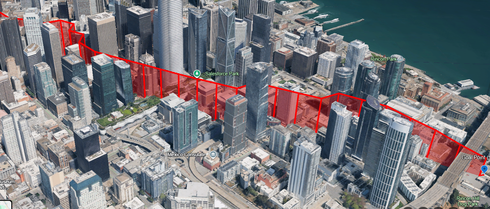
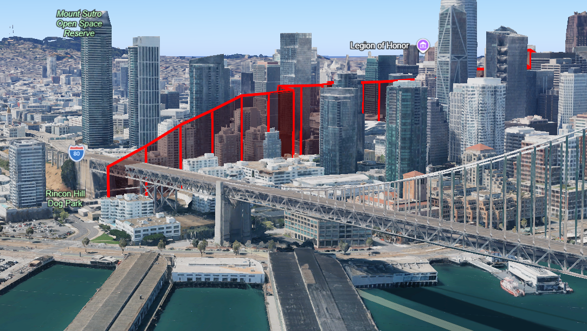

# DragonFly UTM Routing Engine

3D drone route planning engine for urban environments using **H3 spatial indexing**, **altitude layers**, **building geometry**, and **A* pathfinding**.

---

## Overview

DragonFly generates altitude-aware drone routes through complex urban environments.

The routing model combines:

* H3-based spatial representation
* 3D altitude layers
* Building footprints and heights
* A* pathfinding
* Wind/environment data
* Start and goal coordinate handling
* Building collision validation

The system is structured so that the **API layer exposes routing**, while the **routing engine contains the routing logic**.

---

## Architecture

```text
                    Client
                      │
                      │ POST /route
                      ▼
              ┌─────────────────┐
              │   FastAPI API   │
              │                 │
              │ api/routes.py   │
              │ api/models.py   │
              └────────┬────────┘
                       │
                       ▼
              ┌─────────────────┐
              │ Routing Engine  │
              │                 │
              │ engine/          │
              │ routing_engine.py│
              └────────┬────────┘
                       │
          ┌────────────┼─────────────┐
          │            │             │
          ▼            ▼             ▼
    ┌──────────┐ ┌────────────┐ ┌─────────────┐
    │Buildings │ │ Pathfinder │ │  Weather /  │
    │          │ │   A* 3D    │ │ Environment │
    └──────────┘ └────────────┘ └─────────────┘
          │            │
          └────────────┼─────────────┐
                       ▼             │
                 H3 + Altitude       │
                    Voxels            │
                       │              │
                       └──────┬───────┘
                              ▼
                       Generated Route
```

---

## Project Structure

```text
dragon_fly/
│
├── main.py
│
├── api/
│   ├── __init__.py
│   ├── routes.py
│   └── models.py
│
├── engine/
│   ├── __init__.py
│   └── routing_engine.py
│
├── src/
│   ├── pathfinder.py
│   └── utm_interfaces.py
│
├── building_service/
│   ├── building_service.py
│   └── artifacts/
│       └── sf_buildings.geojson
│
├── weather_service/
│   └── get_weather_data.py
│
├── demo_10.kml
├── requirements.txt
└── README.md
```

---

## Component Responsibilities

### `main.py`

Application entry point.

Responsible only for creating the FastAPI application and registering the API router.

```python
from fastapi import FastAPI

from api.routes import router

app = FastAPI(
    title="DragonFly UTM Routing Engine",
    version="1.2",
)

app.include_router(router)
```

---

### `api/routes.py`

Defines the HTTP API.

The API layer:

* Receives requests
* Validates input through Pydantic models
* Calls the routing engine
* Converts engine errors into HTTP responses

The routing algorithm does not live here.

---

### `api/models.py`

Contains API request models and validation rules.

Main request model:

```text
RouteRequest
```

Parameters include:

| Parameter                         | Description                        |
| --------------------------------- | ---------------------------------- |
| `start_lat`                       | Start latitude                     |
| `start_lon`                       | Start longitude                    |
| `goal_lat`                        | Goal latitude                      |
| `goal_lon`                        | Goal longitude                     |
| `start_altitude_meters`           | Start altitude                     |
| `goal_altitude_meters`            | Goal altitude                      |
| `minimum_transit_altitude_meters` | Minimum altitude during transit    |
| `max_altitude_meters`             | Maximum permitted routing altitude |

---

### `engine/routing_engine.py`

Contains the routing orchestration.

Responsibilities include:

1. Loading building data
2. Loading environmental data
3. Building the 3D routing space
4. Determining blocked H3/altitude cells
5. Connecting exact coordinates to the routing graph
6. Running the A* pathfinder
7. Validating route segments
8. Constructing the final route response

FastAPI-specific logic remains outside the engine.

---

### `src/pathfinder.py`

Contains the 3D A* pathfinding implementation.

The routing graph is represented as:

```text
(H3 Cell, Altitude Layer)
```

For example:

```text
(H3 cell A, 15 m)
(H3 cell A, 30 m)
(H3 cell B, 30 m)
(H3 cell C, 45 m)
```

The pathfinder searches through these states while considering:

* Horizontal movement
* Vertical movement
* Diagonal movement where permitted
* Blocked cells
* Distance cost
* Altitude changes
* Wind/environment costs
* Goal direction
* Movement penalties

---

## Routing Model

DragonFly represents the urban environment as a 3D voxel-like search space.

Each routing state consists of:

```text
H3 spatial cell
+
Altitude layer
```

Current configuration:

```text
H3 Resolution:        11
Altitude Layer Height: 15 m
Maximum Altitude:     300 m
Maximum Layers:       20
```

This creates a structured 3D search space suitable for A* pathfinding.

---

## Building Model

Building data is loaded from:

```text
building_service/artifacts/sf_buildings.geojson
```

The building dataset contains:

* Building footprints
* Building heights
* Floor information where available
* Other building attributes

### Building Height

Height is determined using the following priority:

```text
1. height
2. num_floors × 3.5 m
3. 15 m fallback
```

`level` is not used as total building height.

### Effective Obstacle Height

The current implementation adds vertical clearance to the building height:

```text
effective obstacle height
=
building height
+
vertical clearance
```

Current vertical clearance:

```text
15 m
```

The building footprint is also expanded using the configured horizontal safety margin.

Current horizontal safety margin:

```text
15 m
```

The resulting building geometry is converted into blocked H3/altitude states for routing.

---

## Example

For a building with:

```text
Building height = 42 m
Vertical clearance = 15 m
```

The effective obstacle height becomes:

```text
42 + 15 = 57 m
```

With 15 m altitude layers, the pathfinder must route above the corresponding blocked layers.

A route can therefore move from:

```text
0 m
  ↓
15 m
  ↓
30 m
  ↓
45 m
  ↓
60 m
```

and continue above the effective obstacle height.

---

## API

### Endpoint

```text
POST /route
```

### Example Request

```json
{
  "start_lat": 37.79448372,
  "start_lon": -122.40547051,
  "goal_lat": 37.78695766,
  "goal_lon": -122.38931347,
  "start_altitude_meters": 0,
  "goal_altitude_meters": 0,
  "minimum_transit_altitude_meters": 30,
  "max_altitude_meters": 300
}
```

### Example Response Structure

```json
{
  "route": [],
  "total_waypoints": 0,
  "total_distance_meters": 0,
  "metadata": {}
}
```

The exact response contains the generated route waypoints together with routing metadata.

---

## Running the Application

Install dependencies:

```bash
pip install -r requirements.txt
```

Start the API:

```bash
uvicorn main:app --reload
```

The API will be available through the local FastAPI server.

Interactive API documentation is available at:

```text
/docs
```

---

## Routing Configuration

Current routing configuration:

| Parameter                |      Value |
| ------------------------ | ---------: |
| H3 Resolution            |         11 |
| Altitude Layer           |       15 m |
| Maximum Altitude         |      300 m |
| Horizontal Safety Margin |       15 m |
| Vertical Clearance       |       15 m |
| Endpoint Search Radius   | 3 H3 cells |

These values are configuration parameters of the current routing implementation and can be refined as the routing model develops.

---

## Development Approach

DragonFly is being developed in stages.

### 1. Routing Foundation

Establish a reliable 3D routing engine based on:

* H3
* Altitude layers
* Building obstacles
* A* search

### 2. Route Quality

Improve:

* Route distance
* Altitude changes
* Unnecessary zig-zag movement
* Climb/descent behaviour
* Search efficiency

### 3. Environmental Constraints

Introduce additional real-world constraints such as:

* Weather
* Wind
* Terrain/elevation
* Restricted airspace
* No-fly zones
* Drone performance limits

### 4. Product Layer

Develop:

* Stable API contracts
* Route metadata
* Configuration
* Error handling
* Visualization
* Performance optimization

### 5. Validation and Research

Maintain reproducible routing experiments and measurements including:

* Route success rate
* Computation time
* Route distance
* Altitude profile
* Number of altitude transitions
* Building density
* H3 resolution
* Search-space size

This provides a foundation for systematic evaluation of the routing algorithms as the product develops.

---

## Working Routing Demonstration

The following test demonstrates the current 3D routing behaviour in a dense San Francisco building area.

### Request

```json
{
  "start_lat": 37.79448372,
  "start_lon": -122.40547051,
  "goal_lat": 37.78695766,
  "goal_lon": -122.38931347,
  "start_altitude_meters": 0,
  "goal_altitude_meters": 0,
  "minimum_transit_altitude_meters": 30,
  "max_altitude_meters": 300
}
```

### Result

The generated route successfully navigates through the building-dense area by using the available altitude layers rather than simply following a straight horizontal path.


This image is a visual reference for the current routing milestone. The red route represents the generated 3D route relative to the surrounding building environment.


### Result

The generated route successfully navigates through the building-dense area by using the available altitude layers rather than simply following a straight horizontal path.





This image is a visual reference for the current routing milestone. The red route represents the generated 3D route relative to the surrounding building environment.
